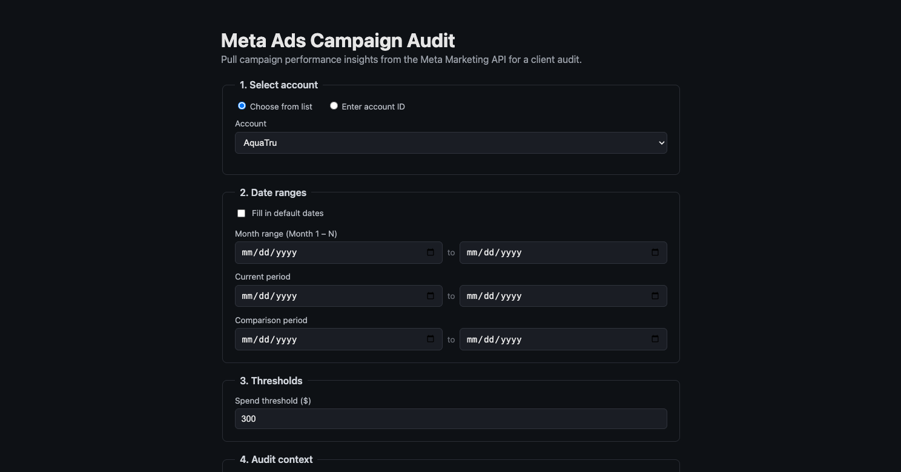
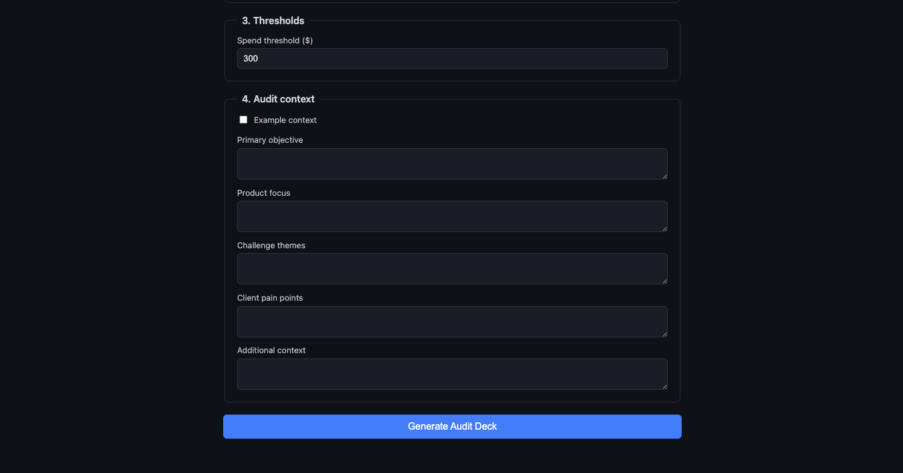
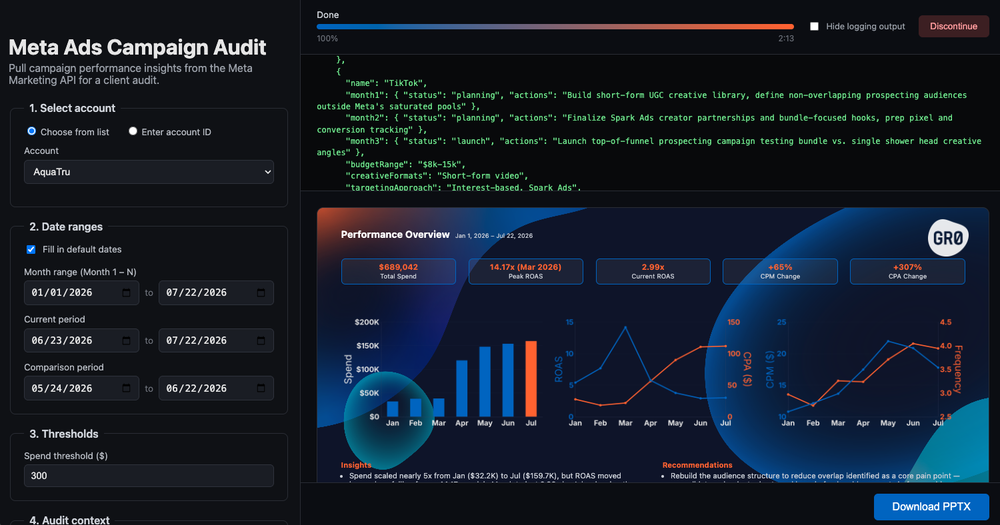
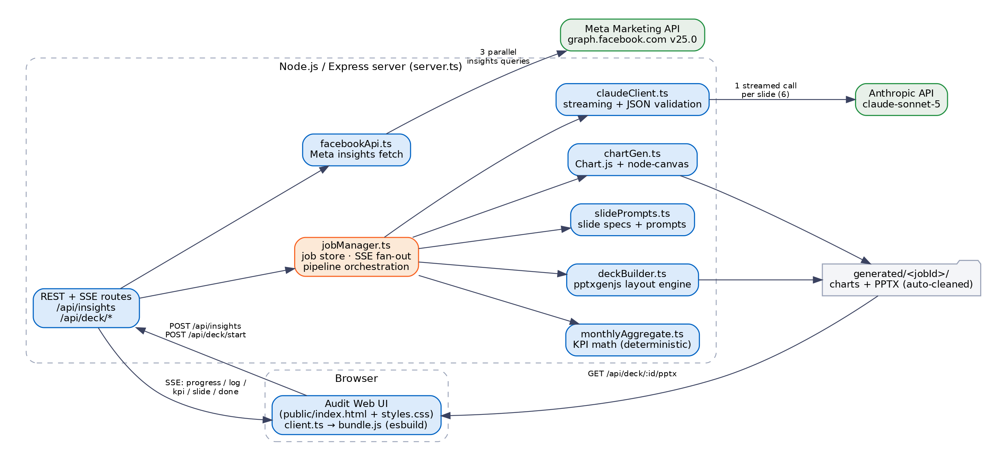
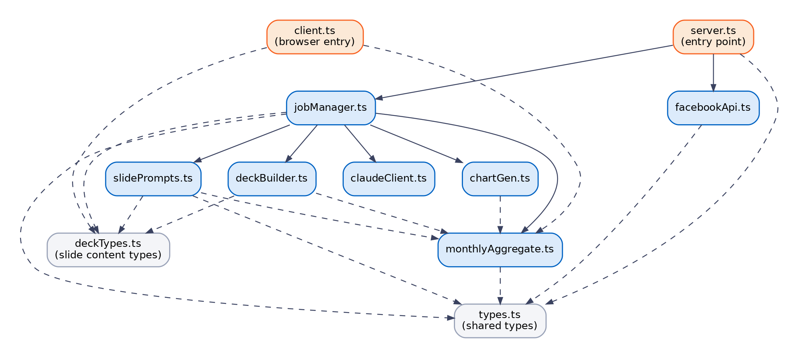
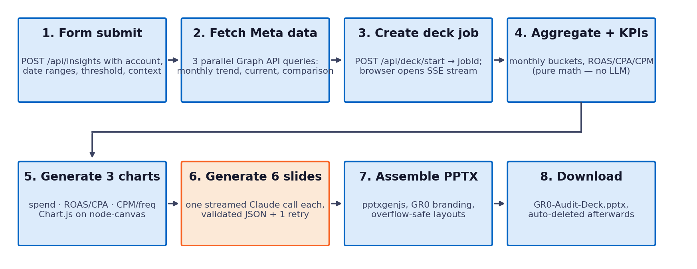

# Meta Ads Audit Deck Generator

Automates GR0's Meta Ads account audit workflow end to end: pulls campaign performance directly from the Meta Marketing API, computes audit KPIs deterministically, writes the audit narrative with Claude, and assembles a fully branded, client-ready PowerPoint deck — all from a single web form.

## Business Impact

Producing one audit deck previously took roughly **1.5 hours** per account even with Claude-assisted workflows — manually exporting insights from Ads Manager, computing period-over-period comparisons, building charts, drafting the narrative, and laying everything out on branded slides. With this tool the same deliverable takes **at most 5 minutes** of wall-clock time — a **94% reduction** in turnaround per audit.

| | Before (Claude-assisted manual process) | After (this tool) |
|---|---|---|
| Time per audit | ~1.5 hours | ≤ 5 minutes (94% faster) |
| Data collection | Manual exports from Ads Manager | Automated Meta Marketing API pulls |
| KPIs & charts | Hand-computed, hand-built | Deterministic math + auto-rendered charts |
| Narrative | Drafted and formatted by hand | Claude-generated, schema-validated |
| Deck layout | Manual slide-by-slide styling | Auto-assembled, GR0-branded PPTX |

**Efficient usage scenarios:**

1. **Audits for prospects** — sales and growth teams generate a full audit deck for a prospective client's ad account during the pitch cycle.
2. **Internal client ads auditing & reporting** — account teams produce recurring performance audits and reporting decks for existing clients without any manual deck work.

## What It Looks Like

Fill in the four-step audit form (account, date ranges, spend threshold, audit context):





Then watch the deck generate live — progress bar, streaming Claude output, and slide previews — and download the finished PPTX:



## Quick Start

```bash
npm install
cp .env.example .env   # fill in META_SYSTEM_USER_TOKEN, ANTHROPIC_API_KEY
npm run dev            # builds the client bundle, starts server at http://localhost:3000
```

| Variable | Purpose |
|---|---|
| `META_SYSTEM_USER_TOKEN` | Meta system-user token used for all Graph API insights calls |
| `ANTHROPIC_API_KEY` | API key for slide generation (`claude-sonnet-5`) |
| `PORT` | HTTP port (defaults to `3000`) |

Scripts: `npm run dev` (build client + tsx watch), `npm start` (non-watch), `npm run typecheck` (`tsc --noEmit`). There is no separate server build — `tsx` executes the TypeScript directly.

## System Overview

A single-page web app backed by a Node.js/Express server. The server fetches campaign insights from the Meta Marketing API, then runs an asynchronous deck-generation job that aggregates the data, renders charts, generates six slides' worth of narrative with Claude, and assembles the final PPTX. The browser follows the job live over Server-Sent Events (SSE).



## Tech Stack

| Layer | Technology | Notes |
|---|---|---|
| Language | TypeScript 5.5 (strict) | ES2022 modules throughout (`"type": "module"`) |
| Runtime | Node.js + tsx | Runs the TypeScript server directly; no compile step in dev |
| Web server | Express 4 | JSON API, static file serving, SSE endpoints |
| Client build | esbuild | Bundles `src/client.ts` → `public/bundle.js` (IIFE) |
| Front end | Vanilla TypeScript + HTML/CSS | No framework; DOM APIs and `EventSource` |
| Data source | Meta Marketing API v25.0 | Campaign-level insights via `graph.facebook.com` |
| AI generation | `@anthropic-ai/sdk` 0.32 | Streaming Messages API, model `claude-sonnet-5` |
| Charts | Chart.js 4 + `chartjs-node-canvas` | Server-side PNG rendering on node-canvas (Cairo); bundled Inter fonts |
| Deck output | `pptxgenjs` 3.12 | Programmatic 13.33″ × 7.5″ widescreen PPTX |
| Configuration | dotenv | `.env`: `META_SYSTEM_USER_TOKEN`, `ANTHROPIC_API_KEY`, `PORT` |

## Repository Layout

```
src/
  server.ts            Express entry point; REST + SSE routes
  client.ts            Browser app source (bundled to public/bundle.js)
  facebookApi.ts       Meta Marketing API client
  jobManager.ts        Async job store, SSE fan-out, pipeline orchestration
  monthlyAggregate.ts  Deterministic monthly aggregation and KPI math
  chartGen.ts          Server-side chart rendering (3 PNGs per job)
  slidePrompts.ts      System prompt, 6 slide definitions, per-slide user prompts
  claudeClient.ts      Anthropic streaming wrapper with JSON validation + retry
  deckBuilder.ts       PPTX assembly and slide layout engine
  types.ts             Shared audit request/response types
  deckTypes.ts         Slide content types (server + browser)
public/                index.html, styles.css, bundle.js (built, gitignored)
assets/                GR0 logos, background art, Inter fonts
generated/<jobId>/     Per-job charts + PPTX output (gitignored, auto-deleted)
```

## Module Reference

`server.ts` and `client.ts` are the two entry points (server and browser). `jobManager.ts` is the orchestrator that ties the generation pipeline together. `types.ts` and `deckTypes.ts` are pure type modules shared across both sides — the client imports them for compile-time types only, so browser and server can never drift apart on the shape of the data they exchange.



### `server.ts` — HTTP entry point
Boots Express, loads `.env`, serves the static front end (`public/`) and brand assets (`/assets`). Route handlers are deliberately thin — validation plus a call into `facebookApi.ts` or `jobManager.ts` — so all business logic lives in the modules below.

### `types.ts` — shared audit types
Defines the front end ↔ server contract: `AuditRequest` (form payload), `CampaignInsightRow` (one simplified Meta insights row), and `AuditResponse` (filters + context + monthly trend + period comparison). Also holds the `KNOWN_ACCOUNTS` map (AquaTru, Liquid Plus) and `toAdAccountId()`, which normalizes a preset name or raw numeric ID into Meta's `act_<id>` form.

### `facebookApi.ts` — Meta Marketing API client
`runCampaignAudit()` issues three campaign-level insights queries in parallel: the month-by-month trend (`time_increment=monthly`), the current period, and the comparison period. Each query filters out campaigns below the spend threshold server-side. Purchase metrics are extracted from Meta's multi-attribution action arrays (preferring `omni_purchase`, falling back to `purchase`) so every row carries exactly one canonical purchase count.

### `jobManager.ts` — job store and pipeline orchestrator
`createJob()` registers an in-memory job (UUID, `AbortController`, event history, listener set) and runs the pipeline in the background: aggregate monthly data → render 3 charts → generate 6 slides with Claude (one call per slide) → assemble the PPTX. Every step emits typed SSE events that are stored on the job **and** fanned out to all subscribed browsers; new subscribers get the full event history replayed, so a page that reconnects mid-job catches up instantly. Finished artifacts are deleted 5 minutes after first download, or 24 hours after completion if never downloaded (swept every 60 seconds).

### `monthlyAggregate.ts` — deterministic KPI math
Rolls campaign-month rows up into per-month totals (`aggregateByMonth()`) and derives the headline KPI summary (`computeKpiSummary()`): total spend, peak/current ROAS, CPM/CPA change. Every number shown on the deck comes from this module's arithmetic on fetched Meta data — Claude never computes or restates a KPI, so the deck cannot hallucinate a metric.

### `chartGen.ts` — server-side chart rendering
Renders three 1240×680 PNGs per job with Chart.js on node-canvas: monthly spend (bar, latest month highlighted in GR0 orange), ROAS vs. CPA (dual-axis line), CPM vs. frequency (dual-axis line). Inter fonts from `assets/fonts` are registered explicitly — bare deployment containers ship with no system fonts, which would otherwise render every label as empty glyph boxes.

### `slidePrompts.ts` — slide specs and prompt builder
Declares the deck's content plan: a shared `SYSTEM_PROMPT` (ground every number in the provided data, no generic agency language, end with exactly one fenced JSON block, no filler text) and six `SLIDE_DEFINITIONS` — Performance Overview, Challenges & Solutions, 3-Month Outlook, Proposed Campaign Architecture, Creative Testing Roadmap, and Channel Expansion Roadmap. `buildUserPrompt()` slices in only the account data each slide needs.

### `claudeClient.ts` — Anthropic streaming wrapper
`generateSlideJson()` makes one streamed call per slide (model `claude-sonnet-5`, 8,192 max tokens), forwarding each text delta to the job log. On completion it extracts the trailing ```` ```json ```` block, escapes raw control characters, and rejects any response containing filler text (`placeholder`, `TBD`, `TODO`, `N/A`). A failed response is retried exactly once; cancellations are never retried.

### `deckTypes.ts` — slide content types
Pure type module: the six slide-content shapes (matching the JSON schemas in `slidePrompts.ts`), the server-side `GeneratedSlide` wrapper (chart file paths), and `PublicGeneratedSlide` (charts inlined as base64 data URIs for the browser preview).

### `deckBuilder.ts` — PPTX layout engine
Assembles the deck with `pptxgenjs` on a custom 13.33″ × 7.5″ layout. Every slide gets GR0 brand chrome plus a type-specific layout: KPI stat cards, chart strips, challenge/solution columns, chevron month flows, stage panels with campaign chips, roadmap tables. Since `pptxgenjs` has no text-layout engine, the module ships its own overflow protection: it estimates wrapped line counts, reweights table columns toward text-heavy content, and falls back to a 2pt-smaller font. Panels use a measure-then-draw pattern (the same function measures with a `null` slide and renders with a real one) so measurements can't drift from what's drawn.

### `client.ts` — browser application
Manages the form (dropdown vs. manual account entry, one-click default dates computed in Pacific time so DST can't skew the windows, example-context filler), submits the audit, then drives generation: POSTs insights to `/api/deck/start`, opens an `EventSource` on the SSE stream, and renders progress, elapsed time, streaming logs, and an HTML mock preview of each slide that mirrors the PPTX layouts.

## Deck Generation Pipeline

Steps 1–2 are synchronous (the form waits for the Meta data); everything after runs as a background job streamed over SSE. Step 6 is the only step that calls the Anthropic API.



SSE events consumed by the browser:

| Event | Payload | UI effect |
|---|---|---|
| `progress` | `{ completed, total, label }` | Progress bar % and step label (8 steps total) |
| `log` | `{ chunk }` | Appended to the streaming log panel |
| `kpi` | `KpiSummary` | Cached for the Performance Overview preview |
| `slide` | `PublicGeneratedSlide` | Slide preview card appended (charts as data URIs) |
| `done` | `{ downloadUrl }` | Enables the Download PPTX button |
| `error` | `{ message }` | Error appended to log; stream closes |
| `cancelled` | `{}` | Stream closes after user hits Discontinue |

## HTTP API

| Method & path | Purpose |
|---|---|
| `POST /api/insights` | Runs the Meta audit fetch; body is `AuditRequest`, returns `AuditResponse` (502 on Meta API errors) |
| `POST /api/deck/start` | Starts a deck job from an `AuditResponse`; returns `202` with `{ jobId }` |
| `GET /api/deck/stream/:jobId` | SSE stream of job events; replays history for late subscribers |
| `POST /api/deck/cancel/:jobId` | Cancels a running job (aborts the in-flight Claude call) |
| `GET /api/deck/:jobId/pptx` | Downloads `GR0-Audit-Deck.pptx`; starts the 5-minute deletion window |

## Reliability & Design Safeguards

- **No hallucinated numbers** — every KPI, chart value, and stat card is computed in `monthlyAggregate.ts` from fetched Meta data; Claude only writes interpretation and recommendations.
- **Hardened LLM output contract** — each slide response must end in a single fenced JSON block matching a declared schema; the parser sanitizes control characters, rejects filler text, and retries a failed slide exactly once.
- **Overflow-safe slide layout** — content is measured before it's drawn, columns are reweighted, and fonts step down when needed, so long Claude output cannot spill off a slide.
- **Responsive, resumable UX** — all long work happens in a background job; SSE event replay means refreshing mid-generation loses nothing, and Discontinue aborts the in-flight Anthropic request immediately.
- **Self-cleaning storage** — jobs live in memory and artifacts under `generated/<jobId>/`, deleted 5 minutes after download or 24 hours after completion.

## Notes

- `.env` holds live credentials and is gitignored — rotate the Meta token and Anthropic key if the folder is ever shared or synced.
- `public/bundle.js` and `generated/` are build/runtime artifacts and are gitignored.
